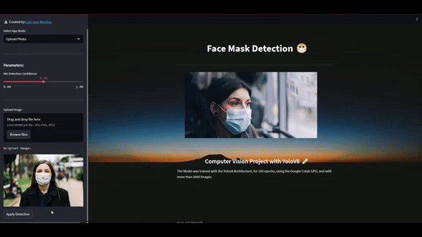
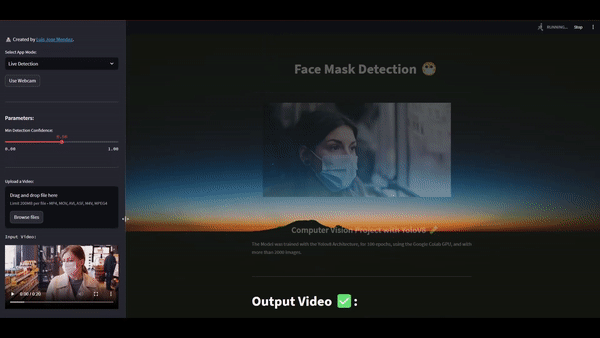

# Face Mask Detection with YOLOv8, OpenCV and Streamlit



## Computer Vision Face Mask Detection Project with YOLOv8, OpenCV and Streamlit

The Face Mask Detection Model was trained using the `YOLOv8` Architecture, the Google Colab `GPU` and with over 2600 Face Mask Images. The U.I. was built with `Streamlit`. It can be test it with uploading a Picture, Video, or in Real Time Detection.

## Run it Locally

Test it Locally by running the `app.py` file, built with `Streamlit`. Remember first to install all the requirements needed in the `requirements.txt` file.

## App made with Streamlit
```sh
streamlit run app.py
```



## Resources
- Face Mask Dataset: https://universe.roboflow.com/thesis-e02gj/face-mask-data-set-wr0t6/dataset/1

